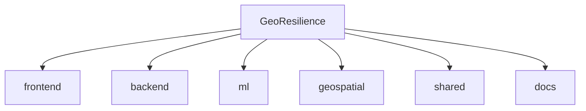

# GeoResilience

An AI-powered landslide early warning, risk monitoring, field verification, and infrastructure impact platform for the North Eastern Region of India.

## Repository Structure



- `frontend/`: Next.js React Application
- `backend/`: FastAPI Backend Services (planned)
- `ml/`: XGBoost/LightGBM risk prediction models (planned)
- `geospatial/`: Infrastructure and connectivity analysis tools (planned)
- `shared/`: API JSON contracts and mock data
- `docs/`: Team ownership, research, and API docs

## Team Ownership

Please refer to [`docs/team-ownership.md`](./docs/team-ownership.md) for module boundaries. 
- **Hitanshi**: Architecture, Integration, Shared Contracts
- **Aarya**: Core Frontend (Dashboard, Risk Map)
- **Fenil**: Field Reporting Frontend
- **Harshal**: Machine Learning
- **Purv**: Geospatial Data & Impact
- **Janhavi**: Research, QA, Demo Scenarios

## Prerequisites
- Node.js (v18+)
- Python 3.10+
- npm or pnpm

## Development Commands

### 1. Frontend
The frontend has a built-in mock API abstraction, meaning you can develop the UI without running the backend.

```bash
cd frontend
npm install
npm run dev
```
Visit http://localhost:3000

*To test with real backend APIs once ready, set `NEXT_PUBLIC_USE_MOCK_DATA=false` in `frontend/.env`*

### 2. Backend (Upcoming)
```bash
cd backend
python -m venv venv
source venv/bin/activate  # On Windows: venv\Scripts\activate
pip install -r requirements.txt
uvicorn app.main:app --reload
```

### 3. ML & Geospatial
Please refer to the respective `README.md` files inside `ml/` and `geospatial/`.

## Contributing
Please see `CONTRIBUTING.md` for git workflows and branch naming conventions.
