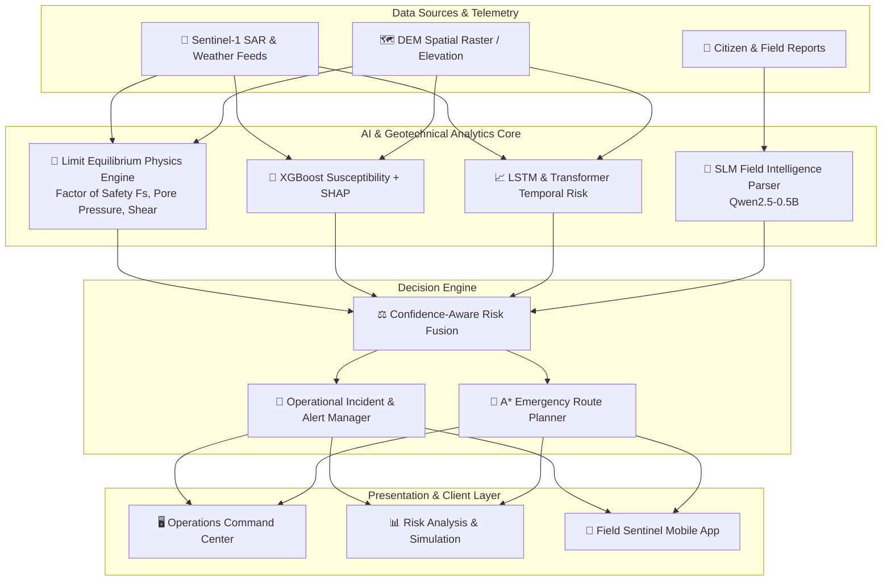
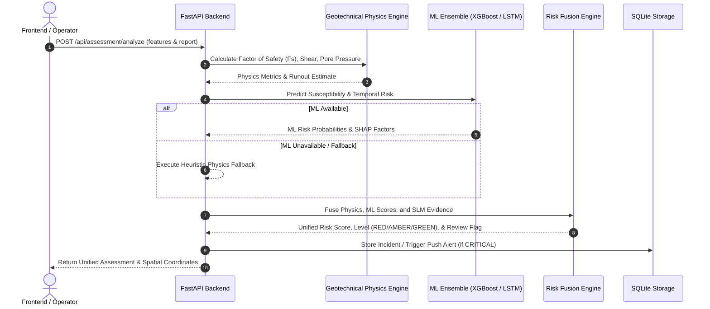
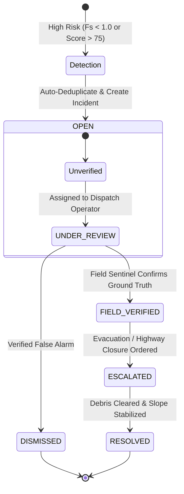

# GeoShield 🇮🇳 — National AI Landslide Early Warning & Disaster Resilience Platform

[](https://www.python.org/)
[](https://fastapi.tiangolo.com/)
[](https://react.dev/)
[](https://vitejs.dev/)
[](https://threejs.org/)
[](LICENSE)

**GeoShield 🇮🇳** is an integrated AI-driven early warning, geotechnical risk analysis, and emergency response platform engineered for landslide-prone regions, with a specialized focus on the North Eastern Region (NER) of India and Himalayan transport corridors (e.g. NH-10).

The system fuses static terrain GIS rasters, real-time meteorological feeds, limit-equilibrium geotechnical physics calculations, machine learning ensembles (XGBoost + SHAP, temporal LSTM/Transformers), and Small Language Model (SLM) field intelligence into parcel-level (Khasra) risk scores and emergency response workflows.

---

## 🌟 Key Features

- 🌐 **3D Photorealistic Earth Intro Loader**: Built with Three.js WebGL rendering, NASA satellite textures, specular ocean reflections, Rayleigh atmosphere scattering, and scroll-triggered camera zoom scrubbing.
- 🏔️ **Geotechnical Limit Equilibrium Engine**: Calculates real-time Factor of Safety ($F_s$), pore water pressure, shear stress, and debris runout reach/inundation area.
- 🤖 **Multimodal AI Ensemble**:
  - **XGBoost Susceptibility**: Predicts baseline terrain risk with SHAP factor attribution.
  - **Temporal LSTM & Transformer**: Analyzes 72-hour antecedent rainfall accumulators and soil moisture trends.
  - **SLM Field Intelligence**: Localized NLP parser (Qwen2.5-0.5B) extracting hazard type, severity, and urgency from citizen text reports.
- 🗺️ **Parcel-Level Khasra Cadastre Visualization**: Interactive Leaflet maps mapping risk predictions to cadastral land parcels (e.g. Khasra 104/A, 104/B, 108).
- 🧭 **Safe Disaster Routing**: A* shortest path algorithm avoiding high-risk zones and active landslide blockages along critical highways.
- 📱 **Responsive & LAN-Ready Architecture**: Built for emergency field deployments with binding to `0.0.0.0`, configurable `VITE_API_BASE_URL`, and internal sidebar collapse toggles for desktop and mobile devices.

---

## 🏗️ System Architecture & Data Flow



---

## ⚡ Risk Fusion Sequence



---

## 🔄 Emergency Incident Lifecycle



---

## 🛠️ Quick Start & Setup Guide

### 1. Repository Setup

```bash
git clone https://github.com/hitanshinahar/georesilience.git
cd georesilience
```

### 2. Backend Setup (FastAPI)

```bash
cd backend

# Create & activate Python virtual environment
python -m venv venv
source venv/bin/activate  # On Windows: venv\Scripts\activate

# Install dependencies
pip install -r requirements.txt

# Start FastAPI dev server (listening on 0.0.0.0 for LAN access)
python -m uvicorn app.main:app --host 0.0.0.0 --port 8000 --reload
```

Backend will be available at:
- Local: `http://localhost:8000`
- Health Check: `http://localhost:8000/health`
- Interactive API Docs (Swagger): `http://localhost:8000/docs`

### 3. Frontend Setup (React + Vite)

In a new terminal:

```bash
cd frontend-v2

# Install Node dependencies
npm install

# Configure environment variable (Optional for LAN access)
# Edit .env file:
# VITE_API_BASE_URL=http://<YOUR_LAPTOP_IP>:8000

# Start Vite dev server
npm run dev
```

Frontend will be available at:
- Web App: `http://localhost:5173`
- LAN Access: `http://<YOUR_LAN_IP>:5173`

---

## 📡 Live REST API Endpoints

| Method | Endpoint | Description |
| :--- | :--- | :--- |
| `GET` | `/health` | System health check and status verification |
| `GET` | `/api/weather/current` | Live meteorological telemetry (rainfall accumulators, moisture) |
| `GET` | `/api/spatial/terrain` | Spatial DEM features (slope, aspect, elevation, TRI) |
| `POST` | `/api/risk/predict` | Geotechnical physics & ML landslide risk assessment |
| `POST` | `/api/routing/astar` | A* emergency route planning avoiding hazard zones |
| `POST` | `/api/field-intelligence/analyze` | SLM natural language extraction from text reports |
| `GET` | `/api/incidents` | List active hazard incidents |
| `PATCH` | `/api/incidents/{id}` | Update incident review status (`FIELD_VERIFIED`, `RESOLVED`) |
| `GET` | `/api/alerts` | Active emergency notifications |
| `GET` | `/api/reports` | Historical field intelligence reports |

---

## 📁 Repository Structure

```text
georesilience/
├── backend/                  # FastAPI Application & Business Services
│   ├── app/
│   │   ├── core/            # Database initialization & SQLite models
│   │   ├── routers/         # REST API route handlers
│   │   ├── schemas/         # Pydantic data schemas
│   │   └── services/        # Physics engine, A* routing, incident logic
│   └── requirements.txt
├── frontend-v2/              # React 19 + Vite + Three.js Frontend
│   ├── src/
│   │   ├── api/             # GeoAPI client with environment configuration
│   │   ├── components/      # EarthLoader, AppShell, Topbar, Sidebar
│   │   ├── pages/           # Command Center, Risk Analysis, Simulation
│   │   └── index.css        # Core design tokens
│   ├── package.json
│   └── vite.config.js
├── ml/                       # Machine Learning Models & Inference Scripts
│   ├── artifacts/           # Model weights (XGBoost, SLM tokenizer)
│   ├── fusion/              # Risk fusion normalizer & engine
│   ├── inference/           # XGBoost prediction pipeline
│   └── models/              # LSTM, Transformer & SLM predictors
├── geospatial/               # GIS data processing utilities
└── docs/                     # Technical Documentation & Architecture Specs
```

---

## 📄 License

Distributed under the **MIT License**. See `LICENSE` for more information.
