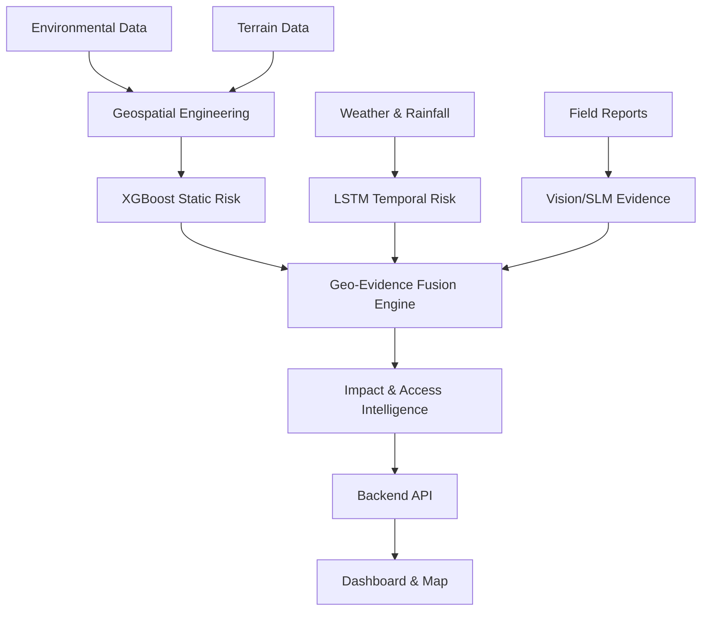

# GeoShield AI

GeoShield AI is an integrated, intelligent platform for early warning and landslide risk monitoring. By combining state-of-the-art machine learning models with geospatial intelligence and crowdsourced field evidence, it acts as a proactive shield against natural disasters, enabling rapid response and informed decision-making.

## Problem

The North Eastern Region (NER) of India is highly susceptible to landslides due to its complex terrain, heavy rainfall, and geological vulnerabilities. Early warning systems are crucial to prevent loss of life, mitigate infrastructure damage, and coordinate rapid response. Current systems often fail to fuse static geospatial risks with dynamic weather conditions and real-time field reports into actionable intelligence.

## What GeoShield AI Does

- **Risk Prediction:** Calculates static and geospatial landslide susceptibility.
- **Temporal Escalation Monitoring:** Detects risk escalation based on sequential weather data.
- **GIS Visualization:** Interactive dashboard and risk map mapping high-risk zones.
- **Field Evidence:** Processes geo-tagged hazard reports from citizens and field officers.
- **Explainability:** Identifies the most influential features behind risk predictions.
- **Infrastructure Impact:** Assesses the exposure of infrastructure and settlements to landslide risk.
- **Road Routing:** Uses mapped road networks to find safer available routes.
- **Terrain-Aware Emergency Corridors:** Computes emergency off-road routes when viable roads are destroyed.

## Core Intelligence

- **XGBoost:** Calculates static landslide risk based on terrain, slope, and historical data.
- **LSTM:** Monitors temporal risk escalation based on time-series rainfall and soil moisture.
- **SHAP:** Explains the XGBoost predictions by identifying key driving factors.
- **Vision and SLM Evidence Processing:** Converts field reports into structured disaster evidence.
- **Geo-Evidence Fusion Engine:** The core algorithm synthesizing static risk, temporal risk, and field evidence into a single, cohesive risk assessment.

## Architecture



## Repository Structure

```
geoshield-ai/
├── frontend/        # Next.js UI, Map interface, API client, Dashboards
├── backend/         # FastAPI backend, Orchestration, Fusion Engine, API routes
├── ml/
│   ├── data/
│   │   ├── raw/
│   │   ├── processed/
│   │   └── sample/
│   ├── preprocessing/
│   ├── models/
│   │   ├── xgboost/
│   │   ├── lstm/
│   │   ├── transformer/
│   │   └── vision/
│   ├── training/
│   ├── inference/
│   └── evaluation/
├── geospatial/
│   ├── data/
│   │   ├── dem/
│   │   ├── landcover/
│   │   ├── boundaries/
│   │   └── roads/
│   ├── processing/
│   └── routing/
├── shared/
│   ├── contracts/   # JSON schema contracts
│   ├── constants/
│   └── types/
├── docs/            # Specifications and documentation
└── scripts/
```

## Technology Stack

| Layer | Technologies |
| --- | --- |
| **Frontend** | Next.js, React, Tailwind CSS, TypeScript, Mapbox GL JS |
| **Backend** | FastAPI, Python, Pydantic, SQLAlchemy |
| **Machine Learning** | Scikit-learn, XGBoost, TensorFlow/PyTorch, SHAP |
| **Geospatial** | GDAL, Rasterio, Shapely, NetworkX, OSRM |
| **Database** | PostgreSQL (PostGIS) |
| **Deployment** | Docker, Docker Compose, GitHub Actions |

## Getting Started

### 1. Frontend
The frontend currently supports a mock API abstraction allowing UI development without running the backend.
```bash
cd frontend
npm install
npm run dev
```

### 2. Backend (Upcoming)
```bash
cd backend
python -m venv venv
source venv/bin/activate  # On Windows: venv\Scripts\activate
pip install -r requirements.txt
uvicorn app.main:app --reload
```

## API

The backend API specification is documented in [docs/API.md](docs/API.md). Communication between modules strictly occurs through established schemas in `shared/contracts`.

## Documentation

- [PRD (Product Requirements Document)](docs/PRD.md)
- [TRD (Technical Requirements Document)](docs/TRD.md)
- [Architecture](docs/ARCHITECTURE.md)
- [API Specifications](docs/API.md)
- [Data Specifications](docs/DATA.md)
- [Team Ownership](docs/team-ownership.md)

## Team Development

Development is strictly siloed by domains to minimize conflicts.
- **frontend/** is owned by frontend developers.
- **backend/** is owned by backend and integration developers.
- **ml/** is owned by ML developers.
- **geospatial/** is owned by GIS engineers.
- Changes to **shared/** require cross-team agreement.

Use proper branch prefixes based on the domain (e.g., `feature/frontend-dashboard`, `feature/ml-xgboost`). Code merges require PRs and domain owner approvals.
