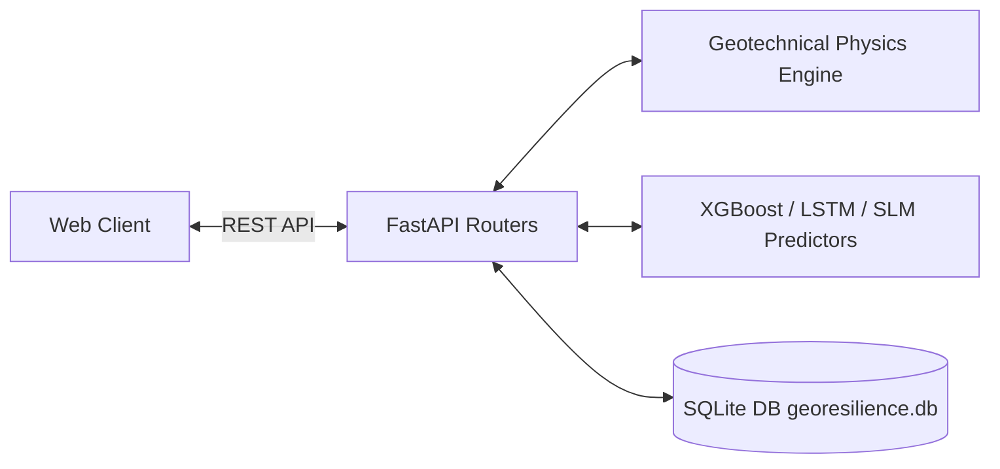

# GeoShield Backend API Server (FastAPI)

The central orchestrator for GeoShield AI, built with **FastAPI**, **Uvicorn**, **Pydantic**, and **SQLite**.

---

## Architecture Flow



---

## Getting Started

```bash
# Activate environment
python -m venv venv
source venv/bin/activate  # On Windows: venv\Scripts\activate

# Install requirements
pip install -r requirements.txt

# Run backend server
python -m uvicorn app.main:app --host 0.0.0.0 --port 8000 --reload
```

---

## Project Structure

- `app/main.py`: Entrypoint & Uvicorn runner
- `app/routers/`: API endpoints (`risk`, `routing`, `slm`, `weather`, `spatial`, `incidents`, `alerts`, `reports`)
- `app/services/`: Geotechnical physics calculations, A* routing, incident deduplication
- `app/core/database.py`: SQLite database initialization and schemas
- `app/schemas/`: Pydantic data validation schemas
