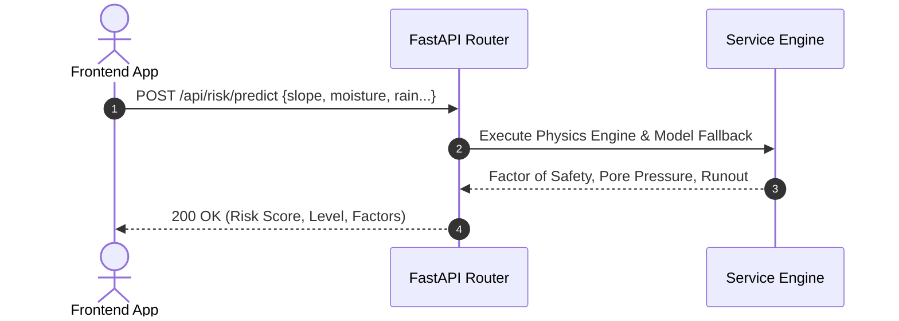

# GeoShield REST API Specifications

The GeoShield AI FastAPI backend provides RESTful endpoints for real-time hazard analytics, geospatial queries, NLP field intelligence parsing, and incident management.

---

## Request Flow Sequence



---

## Endpoint Reference

### 1. System Health Check
- **Endpoint**: `GET /health`
- **Response `200 OK`**:
```json
{
  "status": "ok",
  "service": "georesilience-backend"
}
```

---

### 2. Live Weather Telemetry
- **Endpoint**: `GET /api/weather/current?lat=27.335&lon=88.6`
- **Query Parameters**: `lat` (float), `lon` (float)
- **Response `200 OK`**:
```json
{
  "latitude": 27.335,
  "longitude": 88.6,
  "rainfall_3h_accum_mm": 34.5,
  "rainfall_72h_accum_mm": 112.0,
  "soil_moisture_saturation_pct": 68.2,
  "source": "Sentinel-1 SAR / IMD Feed"
}
```

---

### 3. Spatial Terrain Features
- **Endpoint**: `GET /api/spatial/terrain?lat=27.335&lon=88.6`
- **Query Parameters**: `lat` (float), `lon` (float)
- **Response `200 OK`**:
```json
{
  "elevation_m": 1240.5,
  "slope_deg": 44.2,
  "aspect_deg": 185.0,
  "tri_ruggedness": 52.1,
  "plan_curvature": 0.12,
  "source": "DEM_10M_STEREO"
}
```

---

### 4. Geotechnical and ML Risk Prediction
- **Endpoint**: `POST /api/risk/predict`
- **Request Body**:
```json
{
  "elevation_m": 1000.0,
  "slope_deg": 44.5,
  "aspect_deg": 180.0,
  "tri_ruggedness": 50.0,
  "plan_curvature": 0.1,
  "rainfall_3h_accum_mm": 30.0,
  "rainfall_72h_accum_mm": 90.0,
  "soil_moisture_saturation_pct": 65.0,
  "ground_deformation_proxy_mm_yr": -4.2,
  "anthropogenic_load_proxy_kpa": 10.0
}
```
- **Response `200 OK`**:
```json
{
  "risk_score": 82.0,
  "risk_level": "CRITICAL",
  "static_susceptibility_score": 0.5816,
  "risk_tier": "MODERATE",
  "top_contributing_factors": [
    { "feature": "slope_deg", "contribution": 0.45 },
    { "feature": "soil_moisture_saturation_pct", "contribution": 0.35 },
    { "feature": "rainfall_3h_accum_mm", "contribution": 0.20 }
  ],
  "factor_of_safety": 0.87,
  "runout": {
    "debris_reach_km": 1.72,
    "inundation_area_km2": 0.31,
    "impacted_khasras": 76,
    "impacted_residents": 532
  },
  "pore_pressure_kpa": 3.8,
  "shear_stress_kpa": 34.1,
  "provenance": "Limit Equilibrium Physics Engine (Live Fallback)"
}
```

---

### 5. A* Safe Emergency Route Planning
- **Endpoint**: `POST /api/routing/astar`
- **Request Body**:
```json
{
  "origin": { "lat": 27.33, "lon": 88.6 },
  "destination": { "lat": 27.345, "lon": 88.625 },
  "risk_context": {}
}
```
- **Response `200 OK`**:
```json
{
  "route": [
    { "lat": 27.33, "lon": 88.6 },
    { "lat": 27.338, "lon": 88.61 },
    { "lat": 27.345, "lon": 88.625 }
  ],
  "distance_km": 4.12,
  "estimated_cost": 4.5,
  "avoided_hazard_segments": 1,
  "status": "SUCCESS",
  "provenance": "AStar_RoadGraph_Solver"
}
```

---

### 6. SLM Field Intelligence Analysis
- **Endpoint**: `POST /api/field-intelligence/analyze`
- **Request Body**:
```json
{
  "report_text": "Massive landslide observed on NH-10 near Gangtok ridge. Road completely blocked, rocks falling continuously."
}
```
- **Response `200 OK`**:
```json
{
  "hazard_type": "road_blockage",
  "hazard_confidence": 0.85,
  "severity": "critical",
  "urgency": "immediate",
  "observations": ["deterministic_rule_fallback_activated"],
  "temporal_change": "worsening",
  "recommended_action": "immediate_evacuation_and_road_closure",
  "model_available": true,
  "provenance": "deterministic_rule_fallback"
}
```

---

### 7. Active Incidents Query and Review
- **Query List Endpoint**: `GET /api/incidents`
- **Update Review Endpoint**: `PATCH /api/incidents/{incident_id}`
- **Request Body (`PATCH`)**:
```json
{
  "status": "FIELD_VERIFIED",
  "reviewer_id": "operator_01",
  "note": "Ground team confirmed 40m debris slide."
}
```
