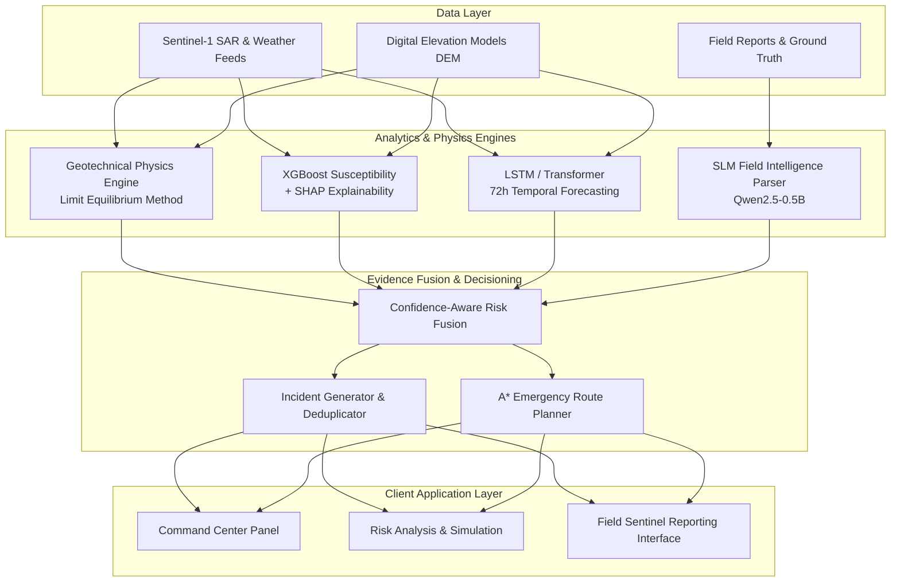
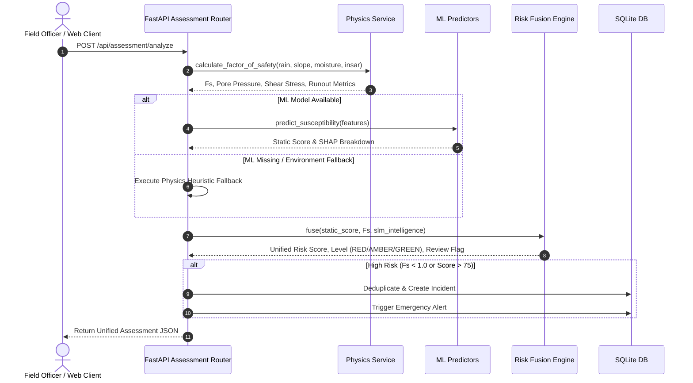
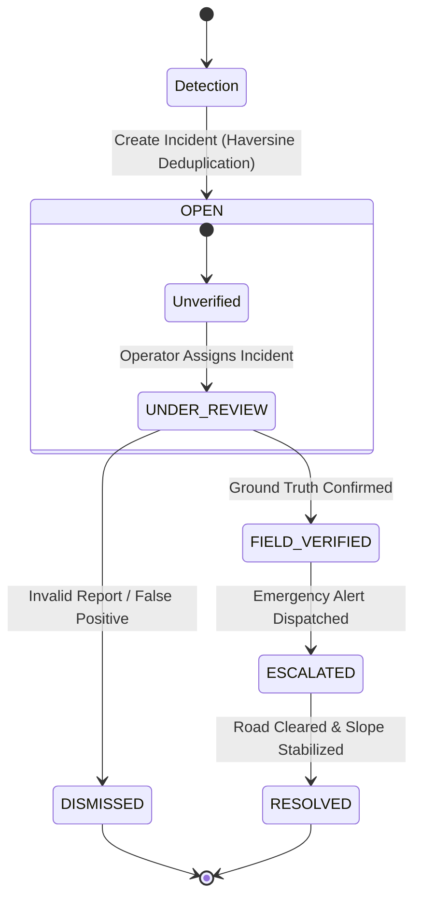

# GeoShield Technical Architecture Specification

GeoShield AI is engineered as a decoupled, multi-modal microservices architecture designed for real-time landslide risk assessment, spatial visualization, and emergency response orchestration.

---

## 1. High-Level Data and Analytics Architecture



---

## 2. Component Specifications

### 2.1 Limit Equilibrium Geotechnical Physics Engine
Located in `backend/app/services/physics_service.py`, this engine provides deterministic physical slope stability calculations independent of machine learning models.

- **Factor of Safety ($F_s$) Calculation**:
  $$\text{Effective Normal Stress } \sigma'_n = \max\left(0.1, \gamma \cdot z \cdot \cos^2\theta - u\right)$$
  $$\text{Resisting Shear Strength } \tau_{\text{res}} = c' + \sigma'_n \cdot \tan\phi'$$
  $$\text{Driving Shear Stress } \tau_{\text{drive}} = \gamma \cdot z \cdot \sin\theta \cdot \cos\theta$$
  $$F_s = \frac{\tau_{\text{res}}}{\max(0.1, \tau_{\text{drive}})}$$
- **Pore Water Pressure Proxy**:
  $$u = 0.098 \cdot \text{Rain}_{3\text{h}} \cdot \left(\frac{\text{Moisture}}{50}\right)$$
- **Empirical Debris Runout Estimation**:
  Calculates debris reach ($\text{km}$), inundation area ($\text{km}^2$), impacted khasras, and affected population based on slope angle and 3-hour accumulated rainfall.

### 2.2 Machine Learning Ensemble & Resilience Fallback
- **XGBoost Susceptibility Model**: Evaluates static terrain features (elevation, slope, aspect, TRI, plan curvature) and returns a baseline susceptibility score (0.0 to 1.0) along with SHAP values.
- **LSTM / Transformer Temporal Models**: Process 72-hour sequential rainfall and moisture data to detect escalating saturation.
- **SLM Natural Language Processor**: Uses Qwen2.5-0.5B-Instruct to convert unstructured text reports into structured JSON (`hazard_type`, `severity`, `urgency`, `observations`).
- **Resilience Fallback System**: If PyTorch/Transformers dependencies or trained ML model weights are absent during emergency deployments, endpoints gracefully fallback to the deterministic physics engine and rule-based heuristic parsers without throwing HTTP `503` errors.

---

## 3. Multimodal Assessment Sequence Flow



---

## 4. Operational Incident & Alert Workflow



---

## 5. LAN & Emergency Deployment Architecture

```mermaid
flowchart LR
    subgraph Host Laptop (Single Source of Truth)
        B[Backend FastAPI Server<br/>Host: 0.0.0.0 : 8000]
        F[Frontend Vite Dev Server<br/>Host: 0.0.0.0 : 5173]
        DB[(SQLite Database<br/>georesilience.db)]
        B <--> DB
        F <-->|VITE_API_BASE_URL| B
    end

    subgraph Client Machine (Friend's Mac / Mobile)
        C[Browser Only<br/>http://LAN_IP:5173]
    end

    C <-->|HTTP / CORS| F
    C <-->|API Calls| B
```

- **Host Binding**: Uvicorn binds to `0.0.0.0:8000` and Vite binds to `0.0.0.0:5173`.
- **Zero Client Overhead**: Client machines (Mac, iPhone, Android) require no Python, Node.js, SQLite, or model installations - only a standard web browser.
- **CORS Handling**: `CORSMiddleware` configured with `allow_origins=["*"]` to allow seamless local network API execution.
