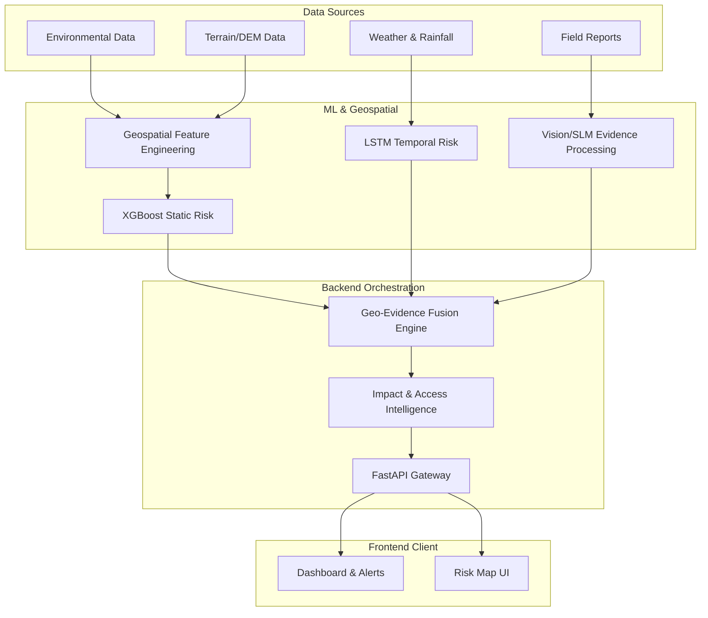
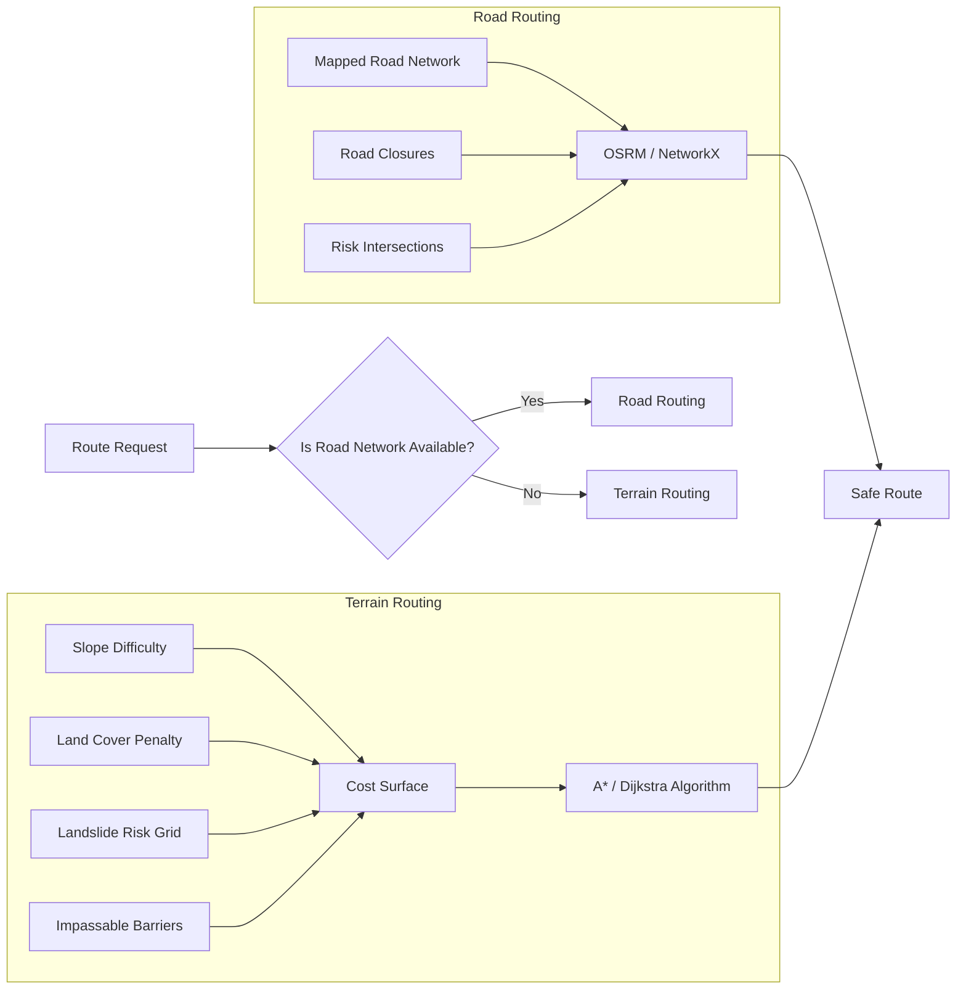

# Technical Architecture

The GeoShield AI architecture follows a clear separation of concerns, orchestrated by the central Backend service. 

## High-Level Data Flow

## Module Boundaries

### Frontend
- Communicates exclusively with the Backend via REST APIs.
- Agnostic of ML and Geospatial implementation details.

### Backend
- Acts as the orchestrator.
- Queries the ML and Geospatial services internally (or imports modules).
- Executes the `Geo-Evidence Fusion Engine`.

### Machine Learning (ML)
- Receives raw or engineered features.
- Returns risk predictions and explanations (SHAP).

### Geospatial
- Generates base grids, slope analyses, and cost surfaces.
- Performs all vector math.

## Routing Systems Architecture

GeoShield AI implements two strictly separated routing paradigms:

**Crucial Note on Routing Limits:** 
Standard road routing systems (like OSRM or Google Maps) cannot perform unrestricted off-road pathfinding. Therefore, GeoShield implements custom Terrain Routing using a computed cost surface and A* search for emergency off-road corridors.
