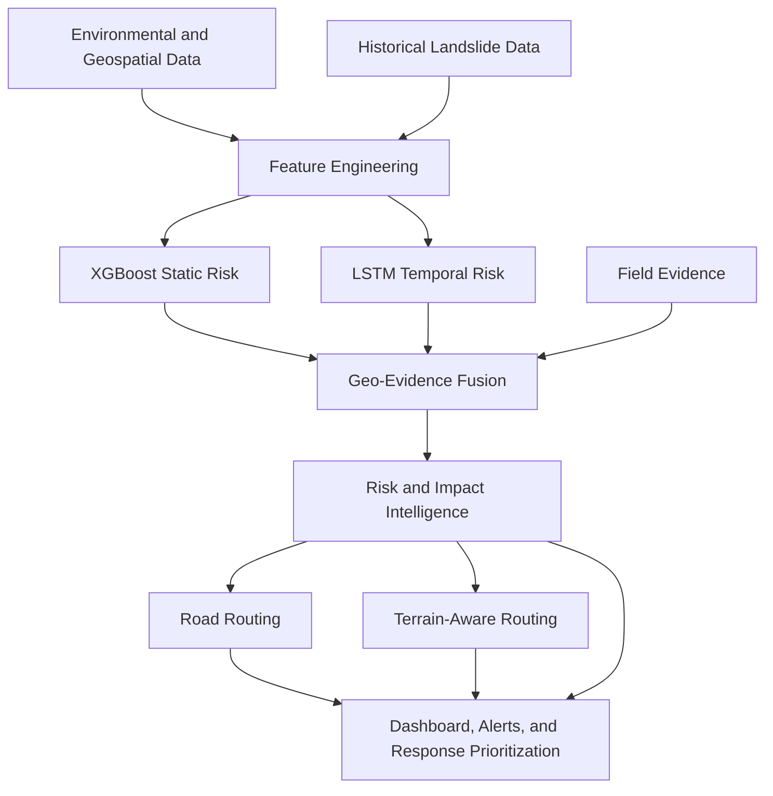

# Technical Architecture

The GeoShield AI architecture follows a clear separation of concerns, orchestrated by the central Backend service.

## Information Flow

## Module Boundaries

### Frontend
Communicates exclusively with the Backend via REST APIs. Agnostic of ML and Geospatial implementation details.

### Backend
Acts as the orchestrator. Queries the ML and Geospatial services internally. Executes the Geo-Evidence Fusion Engine.

### Machine Learning
Receives raw or engineered features. Returns risk predictions and explanations via SHAP.

### Geospatial
Generates base grids, slope analyses, and cost surfaces. Performs all vector math.

## Routing Systems Architecture

GeoShield AI implements two strictly separated routing paradigms:

1. Road Routing
Road routing operates exclusively on mapped road networks. It uses standard graph algorithms to navigate established infrastructure, taking into account known road closures and high-risk intersections.

2. Terrain-Aware Routing
Terrain-aware routing is separate and uses a terrain cost surface. It is utilized when viable road routes are destroyed or unavailable. It computes an emergency off-road corridor based on slope difficulty, land cover penalties, landslide risk, and impassable barriers. 

Important: Standard road routing systems such as OSRM cannot perform unrestricted off-road pathfinding. OSRM is strictly limited to the road network. Terrain routing relies on custom A* implementations traversing the cost surface grids.
