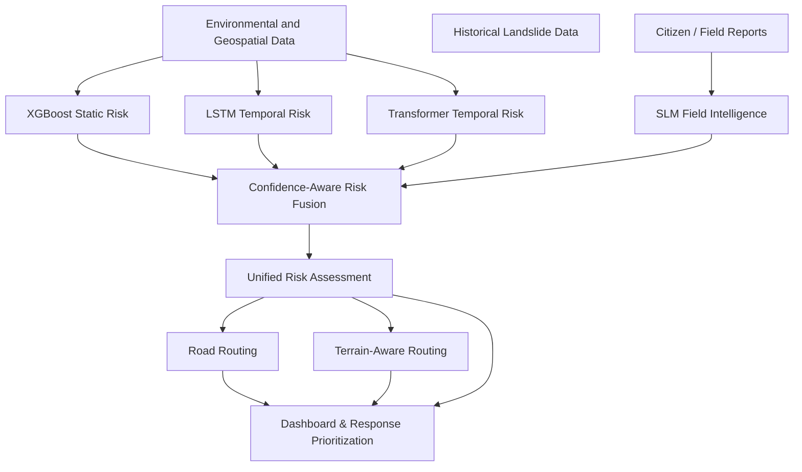

# Technical Architecture

The GeoShield AI architecture follows a clear separation of concerns, orchestrated by the central Backend service.

## High-Level Pipeline

## ML Components and Roles

### 1. XGBoost Predictor
- **Purpose**: Evaluates static terrain features (elevation, slope, soil moisture saturation proxy) to compute a base landslide susceptibility score.
- **Explainability**: Uses SHAP values to determine top contributing features.
- **Output**: Risk score (0.0 to 1.0).

### 2. LSTM & Transformer Predictors
- **Purpose**: Evaluates time-series data (e.g., 72-hour rainfall sequences) to identify escalating temporal risk.
- **Current State**: Uses synthetic/demo sequence processing in the prototype.
- **Output**: Temporal risk score (0.0 to 1.0).

### 3. SLM Field Intelligence
- **Purpose**: Extracts structured information from unstructured citizen/field reports.
- **Model**: Qwen2.5-0.5B-Instruct (local, on-device).
- **Output**: Heuristic labels (hazard type, severity, urgency, observations).
- **Note**: The SLM confidence represents extraction confidence, not disaster prediction probability.

### 4. Confidence-Aware Risk Fusion Engine
- **Purpose**: Synthesizes the independent model scores and field evidence into a unified assessment.
- **Weighting**: Uses prototype heuristics (`base_importance * reliability_factor * availability`). Source reliability factors are **not** statistically calibrated prediction confidence. The output includes an evidence coverage metric, which is not a probability of prediction correctness.
- **Agreement**: Measures spread across numerical models. High spread triggers manual review.
- **Field Evidence**: Mapped to a heuristic score representing the strength of concerning on-ground evidence, not the probability of a landslide. Acts as an escalation factor.

## Microservices Flow

1. **Frontend**: Next.js app sends data payloads to FastAPI backend.
2. **FastAPI Routers**: Routes requests to specific endpoints (`/api/risk/predict`, `/api/risk/fuse`, etc.).
3. **ML Inference**:
   - `ml.inference.predict` handles XGBoost.
   - `ml.models.*.predict` handles LSTM, Transformer, and SLM.
4. **Fusion Engine**:
   - Normalized in `ml.fusion.normalizer`.
   - Agreement checked in `ml.fusion.agreement`.
   - Weighted and fused in `ml.fusion.engine`.
5. **Response**: Returns standardized JSON payloads to the frontend.

## Routing Systems Architecture

GeoShield AI implements two strictly separated routing paradigms:

1. **Road Routing**: Operates exclusively on mapped road networks. Uses standard graph algorithms (OSRM/NetworkX) taking into account known road closures and high-risk intersections.
2. **Terrain-Aware Routing**: Separate terrain cost surface routing utilized when viable roads are destroyed. Computes emergency off-road corridors based on slope difficulty, land cover penalties, landslide risk, and impassable barriers using custom A* implementations.
