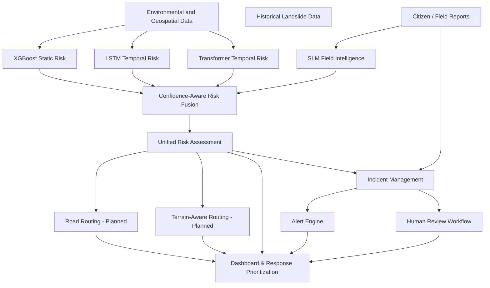

# Technical Architecture

The GeoShield AI architecture follows a clear separation of concerns, orchestrated by the central Backend service.

## High-Level Pipeline

## ML Components and Roles

### 1. XGBoost Predictor
- **Purpose**: Evaluates static terrain features (elevation, slope, soil moisture saturation proxy) to compute a base landslide susceptibility score.
- **Explainability**: Uses SHAP values to determine top contributing features.
- **Output**: Risk score (0.0 to 1.0).

### 2. LSTM & Transformer Predictors
- **Purpose**: Evaluates time-series data (72-hour rainfall sequences) to identify escalating temporal risk.
- **Input**: 72-step sequences of `rainfall_mm`, `cumulative_rainfall_mm`, and `soil_moisture`. Demo scenarios generate full 72-step sequences programmatically.
- **Output**: Temporal risk score (0.0 to 1.0).

### 3. SLM Field Intelligence
- **Purpose**: Extracts structured information from unstructured citizen/field reports.
- **Model**: Qwen2.5-0.5B-Instruct (local, on-device).
- **Output**: Heuristic labels (hazard type, severity, urgency, observations).
- **Note**: The SLM confidence represents extraction confidence, not disaster prediction probability.

### 4. Confidence-Aware Risk Fusion Engine
- **Purpose**: Synthesizes the independent model scores and field evidence into a unified assessment.
- **Weighting**: Uses prototype heuristics (`base_importance * reliability_factor * availability`). Source reliability factors are **not** statistically calibrated prediction confidence. The output includes an evidence coverage metric, which is not a probability of prediction correctness.
- **Agreement**: Measures spread across numerical models. High spread triggers manual review.
- **Field Evidence**: Mapped to a heuristic score representing the strength of concerning on-ground evidence, not the probability of a landslide. Acts as an escalation factor.

## Microservices Flow

1. **Frontend**: Next.js app proxies `/api/*` requests to the FastAPI backend via `next.config.ts` rewrites. The `NEXT_PUBLIC_API_URL` environment variable configures the backend target.
2. **FastAPI Routers**: Routes requests to specific endpoints (`/api/risk/predict`, `/api/risk/fuse`, `/api/reports`, `/api/incidents`, `/api/alerts`).
3. **Phase 6 Assessment Orchestrator** (`/api/assessment/analyze`):
   - Single `POST` endpoint that orchestrates all model inference.
   - Calls XGBoost, LSTM, Transformer, and SLM in sequence.
   - Safely handles unavailable models (marks as unavailable, excluded from fusion weighting) rather than defaulting to zero risk.
   - Passes results to the Fusion Engine and triggers the Phase 7 workflow.
4. **ML Inference**:
   - `ml.inference.predict` handles XGBoost.
   - `ml.models.*.predict` handles LSTM, Transformer, and SLM.
5. **Fusion Engine**:
   - Normalized in `ml.fusion.normalizer`.
   - Agreement checked in `ml.fusion.agreement`.
   - Weighted and fused in `ml.fusion.engine`.
6. **Operational Workflow (Phase 7)**:
   - Evaluates unified assessment against `INCIDENT_CREATION_POLICY`.
   - Generates alerts based on `ALERT_POLICY`.
   - Deduplicates incidents using Haversine distance (`INCIDENT_MATCHING_RADIUS_METERS`).
7. **Response**: Returns standardized JSON payloads to the frontend.

## Persistence Layer (Phase 7)
- **SQLite Database**: `backend/data/georesilience.db` using `sqlite3` built-in module.
- **Tables**: `reports`, `incidents`, `alerts`, `review_actions`.

## Human Review Workflow (Phase 7)
- **Trigger**: `requires_human_review` set by Fusion Engine (due to model disagreement or critical field evidence).
- **Status Progression**: `OPEN` -> `UNDER_REVIEW` -> (`FIELD_VERIFIED` | `ESCALATED` | `DISMISSED` | `RESOLVED`).
- **Audit**: All actions logged in `review_actions` table.

## Future Geospatial Architecture (Phase 9+)

GeoShield AI is architecturally designed to support two strictly separated routing paradigms in a future phase:

1. **Road Routing**: Planned to operate exclusively on mapped road networks. Intended to use standard graph algorithms (OSRM/NetworkX) taking into account known road closures and high-risk intersections.
2. **Terrain-Aware Routing**: Planned separate terrain cost surface routing utilized when viable roads are destroyed. Intended to compute emergency off-road corridors based on slope difficulty, land cover penalties, landslide risk, and impassable barriers using custom A* implementations.

*Note: The current `geospatial/` directory structure reflects this planned architecture but does not contain active routing implementations.*
