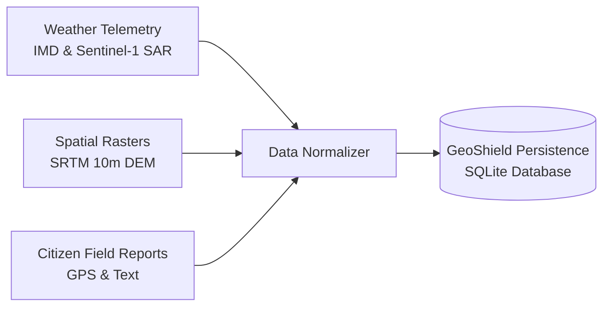

# GeoShield Data Specifications and Telemetry

GeoShield AI integrates spatial elevation rasters, weather telemetry, crowdsourced field reports, and cadastral land records.

---

## Data Pipeline Flow

---

## Integrated Datasets

### 1. Digital Elevation Models (DEM) and Spatial Features
- **Parameters**: Elevation ($m$), Slope ($\text{deg}$), Aspect ($\text{deg}$), Terrain Ruggedness Index ($\text{TRI}$), Plan Curvature.
- **Source**: 10m Stereo DEM Rasters & Deterministic Spatial Proxies.

### 2. Meteorological Telemetry
- **Parameters**: 3-Hour Accumulated Rainfall ($\text{mm}$), 72-Hour Antecedent Rainfall Accumulator ($\text{mm}$), Soil Moisture Saturation ($\%$).
- **Source**: Live Weather Telemetry Feeds & Simulated Extreme Rainfall Scenarios.

### 3. Cadastral Land Records (Parcels / Khasra)
- **Parameters**: Khasra IDs (`104/A`, `104/B`, `108`), Spatial Coordinates (`lat`, `lon`), Land Use Classification.
- **Purpose**: Parcel-level hazard impact mapping and post-disaster resettlement planning.

### 4. Field Intelligence and Reports
- **Parameters**: Textual hazard descriptions, GPS coordinates, severity labels, timestamp.
- **Parser**: Qwen2.5-0.5B Small Language Model (SLM) & Deterministic Heuristic Fallback Engine.
