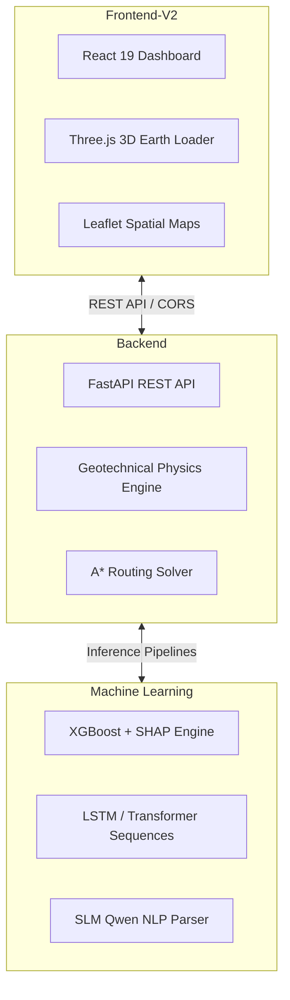

# GeoShield Development and Contribution Guidelines

Guidelines for building, testing, and extending the GeoShield AI codebase.

---

## Repository Architecture



---

## Development Workflows

### 1. Environment Setup
- Python version: **3.10+**
- Node.js version: **18.0+**

### 2. Running Backend Services Locally
```bash
cd backend
python -m venv venv
source venv/bin/activate  # On Windows: venv\Scripts\activate
pip install -r requirements.txt
python -m uvicorn app.main:app --host 0.0.0.0 --port 8000 --reload
```

### 3. Running Frontend Web App Locally
```bash
cd frontend-v2
npm install
npm run dev
```

### 4. Running Verification Tests
```bash
cd backend
python -m pytest tests/ -v
```

---

## Code Conventions

- **Linting and Formatting**: Follow PEP 8 for Python code and ESLint/Oxlint rules for React JavaScript/JSX.
- **Error Handling**: Every ML inference call must provide a deterministic fallback so API routes return `200 OK` during emergency deployments.
- **Git Commit Messages**: Use conventional commits (`feat:`, `fix:`, `docs:`, `style:`, `refactor:`).
