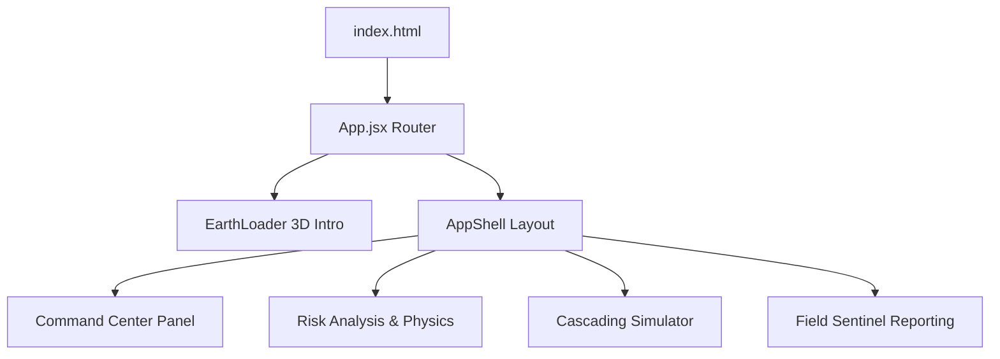

# GeoShield Frontend-v2 (React + Vite + Three.js)

The user interface layer for GeoShield AI, built with **React 19**, **Vite**, **Three.js WebGL**, and **Leaflet Maps**.

---

## UI Architecture



---

## Key Components

- **3D Earth Intro Loader** (`EarthLoader.jsx`): Renders a Three.js WebGL Earth sphere with NASA satellite textures, specular ocean mapping, Rayleigh atmosphere glow, and interactive scroll scrubbing.
- **Operations Command Center** (`CommandCenter.jsx`): Interactive spatial map rendering land cadastre parcels (Khasra 104/A, 104/B, 108), weather alerts, and incident review tools.
- **Risk Analysis Panel** (`RiskAnalysis.jsx`): Displays $F_s$ Factor of Safety metrics, pore pressure, shear stress, and SHAP factor breakdown.
- **Cascading Simulation** (`CascadingSimulation.jsx`): Simulates rain-driven debris flows along Himalayan corridors.
- **Field Sentinel** (`FieldSentinel.jsx`): Allows citizens and first responders to submit hazard reports with live SLM NLP extraction.

---

## Running Locally

```bash
# Install dependencies
npm install

# Start Vite dev server
npm run dev

# Build for production
npm run build
```
