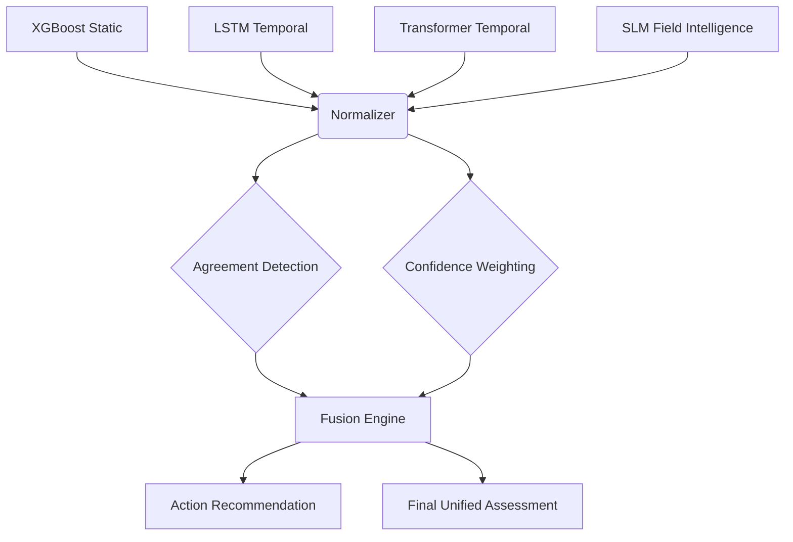

# Phase 5: Confidence-Aware Risk Fusion Engine

The Confidence-Aware Risk Fusion Engine synthesizes independent risk assessments from multiple ML models and field intelligence into a unified, confidence-weighted final risk assessment. This module forms Phase 5 of the GeoResilience backend.

## 1. Purpose

The objective is to combine:
1. **XGBoost**: Static terrain/environmental risk prediction.
2. **LSTM**: Temporal risk over a 72-hour sequence.
3. **Transformer**: Alternative temporal risk over the same sequence.
4. **SLM Field Intelligence**: Unstructured citizen/field officer reports converted into structured heuristic intelligence.

The fusion engine produces a unified decision-support assessment, evaluating agreement among models, escalating risk based on corroborating field evidence, and triggering human review when necessary. Evidence coverage indicates how much of the expected evidence pipeline was available.

## 2. Architecture



## 3. Evidence Normalization

Incoming models provide a `risk_score` (0.0 to 1.0), an optional `confidence` score, and an `available` flag. The normalizer maps these into a uniform `EvidenceSource` schema.

Unavailable sources are explicitly marked as unavailable and excluded from weighting, rather than being treated as a zero-risk prediction.

## 4. Confidence-Aware Weighting

The formula for combining sources is:
`effective_weight = base_importance * reliability_factor * availability`

The effective weights are then normalized across all available sources so they sum to 1.0.

> **Note**: The source reliability factors for XGBoost, LSTM, and Transformer are prototype-defined heuristics based on expected model accuracy, **not** statistically calibrated probabilities.

## 5. Field Evidence Contribution Logic

SLM field intelligence is mapped heuristically to a numerical evidence score based on:
- **Severity**: Base score (e.g., critical = 1.0, low = 0.3)
- **Urgency**: Multiplier (e.g., immediate = 1.3x)
- **Temporal Change**: Multiplier (e.g., rapidly worsening = 1.5x)
- **Observations**: Bonus add-ons (e.g., active_landslide = +0.3)

> **Note**: The `field_evidence_score` represents a heuristic measure of concerning on-ground evidence. It is **not** a probability of landslide occurrence. The SLM `hazard_confidence` represents the text extraction confidence, not disaster prediction confidence.

Field evidence acts as a corroborating or escalating factor and cannot single-handedly override strong low-risk environmental consensus without triggering human review.

## 6. Model Agreement/Disagreement Detection

For numerical models (XGBoost, LSTM, Transformer), we measure disagreement using the maximum spread:
`disagreement_score = max(available numerical risk scores) - min(available numerical risk scores)`

If fewer than two numerical models are available, agreement is `"insufficient_data"`.

**Thresholds**:
- Spread <= 0.10: `high` agreement
- Spread <= 0.25: `medium` agreement
- Spread > 0.25: `low` agreement

Low agreement automatically sets `requires_human_review = True`.

## 7. Risk Thresholds

Prototype decision boundaries map numerical risk (0.0 to 1.0) to categorical levels:
- `GREEN`: 0.0 to 0.35
- `YELLOW`: >0.35 to 0.65
- `ORANGE`: >0.65 to 0.85
- `RED`: >0.85 to 1.0

## 8. Recommended Action Logic

Action recommendations map risk level, agreement, and field evidence to decision support.

Examples:
- **RED + High Agreement**: `emergency_response`
- **ORANGE + Low Agreement**: `field_inspection`
- **YELLOW + Worsening Field Evidence**: `field_inspection`
- **GREEN + High Agreement**: `continue_monitoring`

## 9. API Documentation

### `POST /api/risk/fuse`

Accepts raw model outputs and runs the fusion engine independently.

**Example Request:**
```json
{
  "xgboost": {
    "risk_score": 0.81,
    "confidence": 0.85,
    "available": true
  },
  "lstm": {
    "risk_score": 0.76,
    "confidence": 0.82,
    "available": true
  },
  "transformer": {
    "risk_score": 0.88,
    "confidence": 0.86,
    "available": true
  },
  "field_intelligence": {
    "hazard_type": "slope_crack",
    "hazard_confidence": 0.8,
    "severity": "high",
    "urgency": "inspect",
    "observations": [
      "new_ground_crack",
      "water_seepage"
    ],
    "temporal_change": "worsening",
    "recommended_action": "field_inspection"
  }
}
```

**Example Response:**
```json
{
  "final_risk_score": 0.87,
  "risk_level": "RED",
  "evidence_coverage": 0.89,
  "model_agreement": "high",
  "requires_human_review": false,
  "recommended_action": "field_inspection",
  "source_availability": {
    "xgboost": true,
    "lstm": true,
    "transformer": true,
    "field_intelligence": true
  },
  "contributing_factors": [
      {"source": "xgboost", "risk_score_contribution": 0.28, "raw_score": 0.81, "weight": 0.35},
      {"source": "field_intelligence", "heuristic_metadata": {...}}
  ]
}
```

## 10. Failure Handling

- **Unavailable Sources**: Excluded from normalization weighting.
- **Only One Model Available**: Triggers `requires_human_review = True` and sets `model_agreement = insufficient_data`.
- **Malformed Input**: Gracefully mapped to unavailable.

## 11. Known Limitations

- The temporal models currently use synthetic/demo data.
- The fusion weights and risk thresholds are prototype rules and not scientifically calibrated.
- The field evidence mapping is heuristic.

## 12. Future Improvements

- Calibrate source reliability factors against real historical landslide outcomes.
- Enhance field evidence NLP extraction to output standardized UBERON/Ontology codes for observations.
